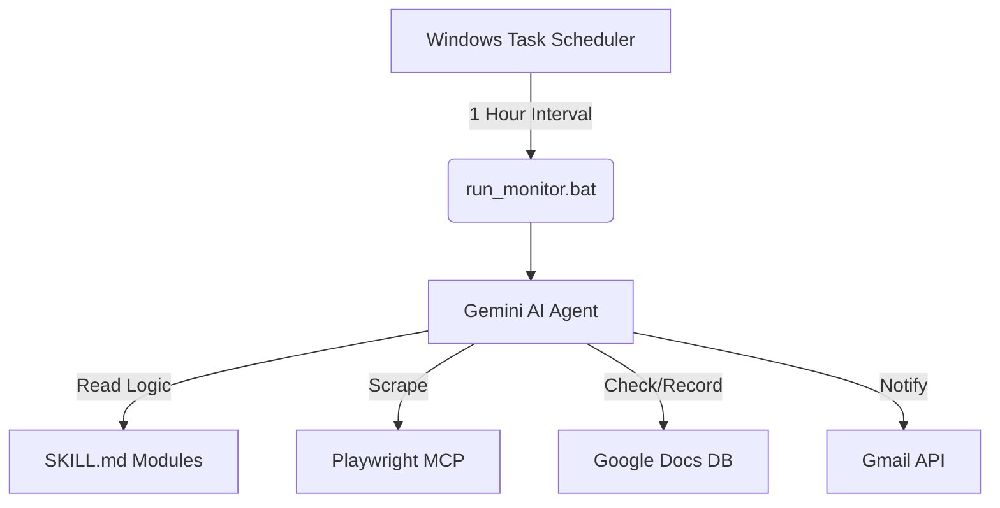

# 📩 Personalized Career Newsletter System

> Gemini AI Agent와 Playwright MCP를 기반으로,  
> 사용자가 지정한 웹사이트의 신규 정보를 자동 수집·분석·전달하는 **AI 기반 커리어 뉴스레터 자동화 시스템**

기존의 정보 플랫폼은 사용자가 직접 여러 웹사이트를 방문하며 기업 소식, 채용 공고, 기술 동향 등을 반복적으로 확인해야 한다는 한계가 있습니다.  
본 프로젝트는 이러한 탐색 과정을 자동화하여, 관심 분야의 최신 정보를 뉴스레터 형태로 통합하고 Gmail로 주기적으로 전달하는 것을 목표로 합니다.

---

## ✨ Features

- 🔍 **Automated Website Monitoring**  
  지정된 웹사이트를 주기적으로 탐색하여 신규 게시물 자동 탐지

- 🤖 **AI Skill-based Processing**  
  Gemini AI Agent가 Skill 문서를 기반으로 사이트별 수집 로직 수행

- 🧠 **Smart Keyword Filtering**  
  특정 키워드(예: `부산지역인재`)가 포함된 게시물만 선별 수집

- 🗂 **Integrated Data Management**  
  Google Docs 기반 기록 관리 및 중복 게시물 방지

- 📬 **Automated Gmail Notification**  
  신규 정보 발생 시 Gmail API를 통해 뉴스레터 자동 전송

- ⏰ **Scheduled Execution**  
  Windows Task Scheduler 기반 주기적 자동 실행

---

## 🏗 System Architecture



---

## 📂 Project Structure

```bash
AX_datascience_FinalProject/
├── integrated-web-monitor/
│   ├── sites/                # 사이트별 수집 로직
│   ├── infra/                # 인프라 및 스케줄러 설정
│   └── SKILL.md              # 통합 Skill 인덱스
├── project.md                # 프로젝트 기획 및 개발 기록
├── run_monitor.bat           # 자동화 실행 파일
└── README.md
```

---

## 🚀 Getting Started

### 1. Environment Setup

다음 환경이 사전에 구성되어 있어야 합니다.

- Gemini CLI
- Playwright MCP
- Google Workspace MCP

### 2. Run

```bash
run_monitor.bat
```

또는 Gemini CLI에서:

```text
통합 웹 모니터링 스킬 실행해줘
```

---

## 🌱 Branch Strategy

| Branch | Description |
|---|---|
| `main` | 안정화된 통합 브랜치 |
| `feature/site-*` | 신규 사이트 수집 기능 개발 |
| `feature/infra-*` | 인프라 및 자동화 기능 개선 |

---

## 📌 Tech Stack

- Gemini AI Agent
- Playwright MCP
- Google Docs API
- Gmail API
- Windows Task Scheduler

---

## 👤 Author

**jjiiw0n**  

프로젝트 상세 개발 기록 및 시행착오는 `project.md`에서 확인할 수 있습니다.
