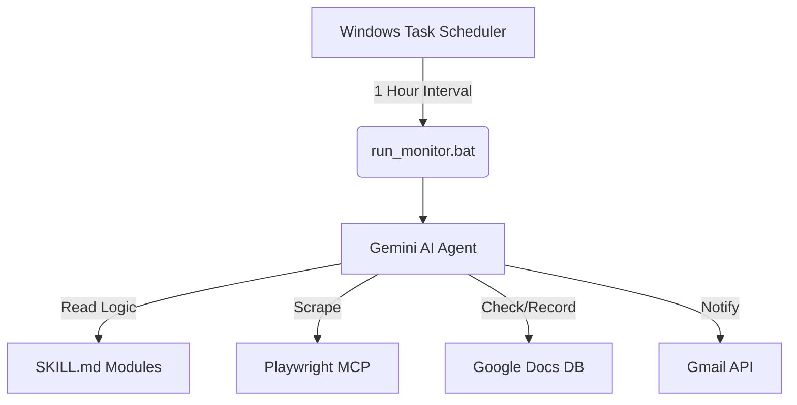

# 🤖 AI-Powered Web Monitoring System


이 프로젝트는 **Gemini AI 에이전트**와 **Playwright MCP**를 활용하여 지정된 웹사이트(ETRI, KT, 부산테크노파크 등)를 자동으로 모니터링하고, 신규 게시물을 탐지하여 기록 및 알림을 수행하는 시스템입니다.

## ✨ 핵심 기능
- **다중 사이트 모니터링:** 각 사이트별 독립적인 수집 로직(Skill) 운영.
- **스마트 필터링:** 특정 키워드(예: '부산지역인재')가 포함된 게시물만 선별 수집.
- **통합 DB 관리:** Google Docs를 활용한 수집 데이터 영구 기록 및 중복 방지.
- **실시간 메일 알림:** Gmail API를 연동하여 신규 소식 즉시 전송.
- **완전 자동화:** 윈도우 작업 스케줄러를 통한 매시간 자동 실행.

## 🏗 시스템 아키텍처
전통적인 하드코딩 방식이 아닌, AI가 지침을 읽고 스스로 판단하여 도구를 조작하는 **AI Skill 기반 아키텍처**를 채택했습니다.



## 📂 프로젝트 구조
```
AX_datascience_FinalProject/
├── integrated-web-monitor/
│   ├── sites/                # 사이트별 수집 로직
│   │   ├── etri.md
│   │   ├── kt.md
│   │   └── btp-talent.md
│   ├── infra/                # 인프라 및 스케줄러 설정
│   │   └── scheduler.md
│   └── SKILL.md              # 통합 스킬 인덱스
├── project.md                # 프로젝트 기획 및 진행 문서
├── run_monitor.bat           # 자동화 실행 배치 파일
└── README.md                 # 프로젝트 가이드
```

## 🚀 시작하기
1. **환경 설정:** Gemini CLI 및 관련 MCP 서버(Playwright, Google Workspace)가 설치되어 있어야 합니다.
2. **명령어 실행:**
   ```bash
   run_monitor.bat
   ```
   또는 Gemini CLI에서 다음을 입력하세요:
   `"통합 웹 모니터링 스킬 실행해줘"`

## 🛠 브랜치 전략
본 프로젝트는 **Feature Branch 전략**을 사용하여 체계적으로 기능을 확장합니다.
- `main`: 안정화된 통합 코드 브랜치
- `feature/site-*`: 새로운 사이트 추가 시 전용 브랜치
- `feature/infra-*`: 시스템 설정 및 인프라 개선 시 전용 브랜치

---
**Author:** [jjiiw0n](https://github.com/jjiiw0n)  
**Project Memory:** 이 프로젝트의 상세 개발 이력은 내부 `project.md`에서 확인 가능합니다.
