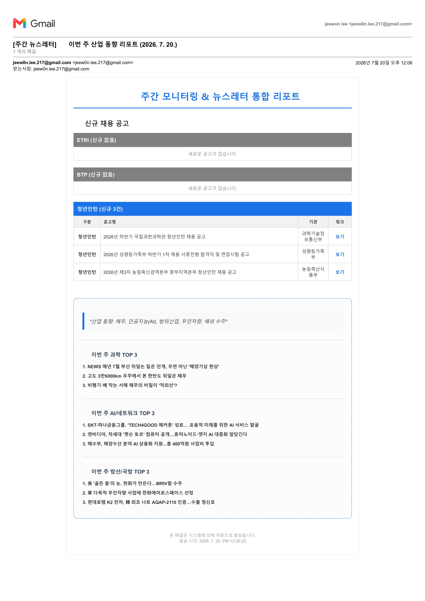

# 📩 Career Newsletter Service

> **여러 채용 사이트의 새로운 소식을 자동으로 확인하고, 놓치지 말아야 할 정보만 이메일 뉴스레터로 전달하는 개인 맞춤형 커리어 모니터링 서비스입니다.**

여러 채용 사이트를 매일 방문하고 새로운 공고가 올라왔는지 반복해서 확인하는 일은 생각보다 많은 시간이 걸립니다.

**Career Newsletter Service**는 등록된 사이트를 자동으로 모니터링하고, 이전에 발송하지 않은 새로운 게시물만 찾아 읽기 쉬운 이메일 뉴스레터로 전달합니다.

---

## 💌 실제 뉴스레터 미리보기



> 사이트별 신규 게시물과 원문으로 바로 이동할 수 있는 상세 링크를 하나의 이메일에서 확인할 수 있습니다.

---

## ✨ 이런 분에게 유용합니다

- 여러 채용 사이트를 매일 확인하는 분
- 관심 분야의 새로운 공고를 놓치고 싶지 않은 분
- 이미 확인한 게시물을 반복해서 보고 싶지 않은 분
- 필요한 커리어 정보를 이메일 한 곳에서 확인하고 싶은 분
- 여러 사이트의 정보를 보기 편한 형태로 받아보고 싶은 분

---

## 💡 주요 기능

### 🔍 여러 사이트 자동 모니터링

사용자가 등록한 채용 및 커리어 관련 사이트를 자동으로 방문하여 최신 게시물을 수집합니다.

GitHub Actions에서 서비스가 정기적으로 실행되기 때문에 개인 컴퓨터를 계속 켜두거나 프로그램을 매번 직접 실행할 필요가 없습니다.

### 🧹 새로운 게시물만 선별

수집한 게시물을 기존 발송 이력과 비교합니다.

이미 확인하거나 발송한 게시물은 제외하고, 새롭게 발견된 정보만 뉴스레터에 포함합니다.

### 👤 구독자별 맞춤 정보 제공

각 구독자는 자신이 관심 있는 모니터링 사이트를 선택할 수 있습니다.

서비스는 구독자별 설정을 확인하여 모든 사용자에게 같은 내용을 보내는 대신, 각 사용자에게 필요한 정보만 모아 뉴스레터를 구성합니다.

### 💌 읽기 쉬운 이메일 뉴스레터

새로운 게시물을 단순한 텍스트 목록으로 보내지 않고, 읽기 편한 HTML 이메일로 정리하여 전달합니다.

뉴스레터에서는 다음 정보를 확인할 수 있습니다.

- 모니터링 사이트별 업데이트 상태
- 새롭게 발견된 게시물 수
- 게시물 제목
- 등록일 또는 모집 기간
- 원문으로 바로 이동할 수 있는 상세 링크
- 신규 게시물이 없는 사이트의 정상 확인 결과

사이트별 결과가 구분되어 있어 여러 사이트의 정보를 하나의 이메일에서 빠르게 확인할 수 있습니다.

### 🔗 원문으로 바로 이동

관심 있는 공고를 발견하면 뉴스레터의 상세보기 링크를 눌러 원본 게시물로 바로 이동할 수 있습니다.

검색 결과를 다시 찾아보거나 해당 사이트의 게시판을 처음부터 탐색할 필요가 없습니다.

### 🛡️ 중복 발송 방지

발송된 게시물의 제목과 링크를 Supabase에 기록합니다.

다음 실행에서는 저장된 이력과 비교하여 같은 게시물이 반복해서 발송되는 것을 방지합니다.

### ⏰ 매일 자동 실행

GitHub Actions가 매일 정해진 시간에 서비스를 실행합니다.

필요한 경우 GitHub의 Actions 화면에서 워크플로를 수동으로 실행하여 새로운 게시물을 즉시 확인할 수도 있습니다.

---

## ⚙️ 서비스는 이렇게 작동합니다

```text
1. GitHub Actions가 서비스를 실행합니다.
                 ↓
2. Supabase에서 활성 구독자와 관심 사이트를 조회합니다.
                 ↓
3. Playwright가 등록된 사이트의 최신 게시물을 수집합니다.
                 ↓
4. 기존 발송 이력과 비교해 새로운 게시물만 선별합니다.
                 ↓
5. 구독자별 HTML 뉴스레터를 생성합니다.
                 ↓
6. Gmail을 통해 이메일을 발송합니다.
```

---

## 🏗️ 시스템 구성

| 구분 | 사용 기술 | 역할 |
|---|---|---|
| 실행 환경 | GitHub Actions | 정기 실행 및 수동 실행 |
| 웹 수집 | Playwright | 등록된 사이트의 최신 게시물 수집 |
| 애플리케이션 | Node.js 22 | 수집, 비교, 뉴스레터 생성 |
| 데이터베이스 | Supabase | 구독자, 관심 사이트, 발송 이력 관리 |
| 이메일 | Nodemailer + Gmail | HTML 뉴스레터 발송 |

---

## 📁 프로젝트 구조

```text
.
├─ .github/
│  └─ workflows/
│     └─ monitor.yml                # GitHub Actions 실행 설정
│
├─ lib/
│  └─ supabase.js                   # Supabase 연결
│
├─ monitor_v2.js                    # 현재 운영 서비스의 진입점
├─ package.json                     # 실행 명령과 의존성
├─ package-lock.json
│
├─ docs/
│  ├─ images/
│  │  └─ newsletter-preview.png     # 실제 뉴스레터 미리보기
│  └─ REVERT_EMAIL_CONFIG.md        # 이메일 설정 복구 문서
│
├─ tests/
│  └─ manual/                       # 수동 테스트 자료
│
├─ data/
│  └─ legacy/                       # 과거 로컬 파이프라인 데이터
│
└─ legacy/                          # 현재 운영에서 제외된 과거 구현
```

> 현재 서비스의 핵심 운영 파일은 `monitor_v2.js`, `lib/supabase.js`, `.github/workflows/monitor.yml`입니다.

---

# 🚀 로컬 설치 및 실행

## 1. 저장소 내려받기

```bash
git clone https://github.com/jjiiw0n/AX_datascience_FinalProject.git
cd AX_datascience_FinalProject
```

## 2. 패키지 설치

```bash
npm ci
```

## 3. Playwright 설치

```bash
npx playwright install chromium
```

## 4. 환경변수 설정

저장소 루트에 `.env` 파일을 만들고 다음 값을 입력합니다.

```dotenv
SUPABASE_URL=your_supabase_url
SUPABASE_ANON_KEY=your_supabase_anon_key
EMAIL_USER=your_gmail_address
EMAIL_PASS=your_gmail_app_password
```

> `.env`, 이메일 비밀번호, 서비스 계정 키 등의 민감정보는 GitHub에 커밋하지 마세요.

## 5. 서비스 실행

```bash
npm start
```

다음 명령으로 동일하게 실행할 수도 있습니다.

```bash
npm run monitor
```

## 6. 코드 검사

```bash
npm test
```

현재 `npm test`는 주요 운영 JavaScript 파일의 문법을 검사합니다.

---

# ☁️ GitHub Actions 배포 및 운영

## GitHub Secrets 등록

GitHub Actions에서 서비스를 실행하려면 저장소에 환경변수를 Secret으로 등록해야 합니다.

GitHub 저장소에서 다음 메뉴로 이동합니다.

```text
Settings
→ Secrets and variables
→ Actions
→ New repository secret
```

다음 네 개의 Secret이 필요합니다.

| Secret | 설명 |
|---|---|
| `SUPABASE_URL` | Supabase 프로젝트 URL |
| `SUPABASE_ANON_KEY` | Supabase 접근 키 |
| `EMAIL_USER` | Gmail 발신 계정 |
| `EMAIL_PASS` | Gmail 앱 비밀번호 |

---

## 자동 실행 시간

GitHub Actions 워크플로 이름은 `Career Newsletter Service`입니다.

- 자동 실행: 매일 `00:00 UTC`
- 한국 시간: 매일 오전 `09:00 KST`
- 실행 환경: `ubuntu-latest`
- Node.js 버전: `22`
- 브라우저: Playwright Chromium

GitHub Actions의 cron 시간은 UTC 기준입니다.

---

## 수동 실행 방법

필요한 경우 예약 시간을 기다리지 않고 서비스를 직접 실행할 수 있습니다.

```text
GitHub 저장소
→ Actions
→ Career Newsletter Service
→ Run workflow
```

실행이 시작되면 다음 단계가 순서대로 진행됩니다.

1. 저장소 코드 내려받기
2. Node.js 환경 설정
3. npm 의존성 설치
4. Playwright Chromium 설치
5. 모니터링 서비스 실행
6. 이메일 뉴스레터 발송

---

## 실행 결과 확인

```text
GitHub 저장소
→ Actions
→ Career Newsletter Service
→ 최근 실행 선택
```

모든 단계가 초록색 체크로 표시되면 정상적으로 완료된 것입니다.

실패한 경우 해당 단계를 선택하여 상세 로그를 확인할 수 있습니다.

---

# 🗄️ Supabase 데이터

현재 운영 코드는 Supabase에서 다음 정보를 관리합니다.

## `subscribers`

활성 구독자와 이메일 정보를 관리합니다.

서비스는 `is_active` 값이 활성화된 구독자만 조회하여 뉴스레터를 발송합니다.

## `monitoring_sites`

각 구독자가 모니터링할 사이트를 관리합니다.

구독자마다 서로 다른 관심 사이트를 설정할 수 있습니다.

## `crawl_history`

이미 확인하고 발송한 게시물의 제목과 링크를 저장합니다.

저장된 기록은 다음 실행에서 중복 게시물을 제외하는 데 사용됩니다.

---

# 🧰 주요 명령어

```bash
# 서비스 실행
npm start

# 모니터링 서비스 실행
npm run monitor

# 운영 코드 문법 검사
npm run check

# 기본 테스트 실행
npm test
```

---

# 📚 레거시 자료

`legacy/`와 `data/legacy/`에는 Supabase와 GitHub Actions를 도입하기 전에 사용하던 로컬 파일 기반 구현이 보관되어 있습니다.

이 자료는 이전 개발 과정과 데이터 형식을 참고하기 위한 용도이며, 현재 GitHub Actions 운영에서는 사용하지 않습니다.

```text
legacy/
├─ pipeline/                # 과거 단계별 수집·분석·발송 스크립트
├─ windows/                 # Windows Task Scheduler 자료
├─ integrated-web-monitor/  # 과거 모듈형 모니터링 문서
└─ docs/                    # 초기 자동화 문서
```

`data/legacy/`의 `*.example.*` 파일은 과거 데이터 형식을 보존한 예제입니다.

---

# 🔐 보안 주의사항

- `.env` 파일을 Git에 추가하지 마세요.
- Gmail 일반 비밀번호가 아닌 앱 비밀번호를 사용하세요.
- Supabase 키와 이메일 비밀번호를 로그에 출력하지 마세요.
- GitHub Actions에서는 모든 민감정보를 Secrets로 관리하세요.
- `service-account-key.json`과 같은 인증 파일을 저장소에 올리지 마세요.
- 뉴스레터 캡처를 공개할 때는 이메일 주소와 개인정보를 가리세요.

---

# 🛣️ 앞으로 추가할 수 있는 기능

- 새로운 기업 및 공공기관 채용 사이트 지원
- 사용자가 직접 관심 사이트를 선택할 수 있는 웹 화면
- 이메일 수신 설정 및 구독 해지 기능
- 공고 마감일을 이용한 우선순위 표시
- 관심 직무 및 키워드 필터링
- AI 기반 공고 요약
- 사용자 이력과 공고 내용을 활용한 직무 적합도 분석
- 관리자용 실행 현황 및 오류 모니터링
- 뉴스레터 디자인 테마 선택 기능

---

# 👤 Author

**jjiiw0n**

GitHub: [jjiiw0n/AX_datascience_FinalProject](https://github.com/jjiiw0n/AX_datascience_FinalProject)
